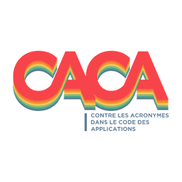

# Contre les Acronymes dans le Code des Applications

## Comment joindre le mouvement ?

Simplement en mettant une étoile à ce dépôt.

## Comment Quitter le mouvement ?

Drôle d'idée, mais bon... Il suffit d'enlever votre étoile.
